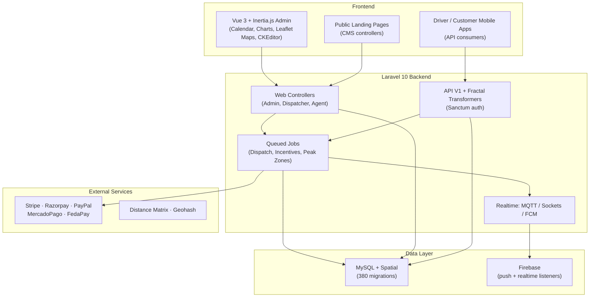

<p align="center"></p>

<p align="center">


</p>

> **Developed by [Arslan Malik](https://github.com/arsalanmaalik461)**
> 📱 WhatsApp: [+92 300 8987448](https://wa.me/923008987448) · 🌐 Website: [arslanmalik.tech](https://arslanmalik.tech)

---

## 🌟 Executive Overview

**StartBid** is a full-stack ride-hailing, dispatch and delivery platform built on Laravel 10 with an Inertia.js + Vue 3 admin and customer experience. The codebase spans roughly 170 controllers and 380 database migrations, which tells you the scale honestly: this is not a demo CRUD app — it is a production-oriented system covering the complete lifecycle of a ride or delivery request, from driver onboarding and real-time dispatch through payments, wallets, chat, complaints and incentives.

The platform is multi-role by design. Customers and ad-hoc users raise ride or delivery requests; dispatchers and agents manage them from a live console; drivers accept work through a real-time pipeline (MQTT / socket notifications with automatic escalation to the next driver when one declines); and administrators control fares, peak zones, documents, banners, email templates and a full landing-page CMS. Payments are handled through five integrated gateways — Stripe, Razorpay, PayPal, MercadoPago and FedaPay — with driver and owner wallets, incentives, loyalty levels and reward points tracked in dedicated ledger models.

On the engineering side, the stack is modern and deliberate: PHP 8.1, Laravel 10, Jetstream, Sanctum token auth, Fractal API transformers with auto-generated Scribe API docs, MySQL spatial extensions for geo work, queued jobs for dispatch orchestration, Firebase Cloud Messaging for push, and a Vue 3 + Bootstrap + Vite frontend enriched with Leaflet maps, FullCalendar, CKEditor, AmCharts and Firebase real-time listeners.

---

## 📑 Table of Contents

- [✨ Key Features & Highlights](#-key-features--highlights)
- [🖥️ Feature Showcase](#️-feature-showcase)
- [🏗️ System Architecture](#️-system-architecture)
- [🚀 Quickstart & Installation Guide](#-quickstart--installation-guide)
- [📂 Project Structure](#-project-structure)
- [🛡️ Security & Notes](#️-security--notes)

---

## ✨ Key Features & Highlights

| Feature | Description |
| :--- | :--- |
| 🔁 Real-time dispatch engine | Queued jobs (`SendRequestToNextDriversJob`, `NotifyViaMqtt`, `NotifyViaSocket`) push requests to drivers and escalate to the next driver when declined, with `NoDriverFoundNotifyJob` fallback handling |
| 🧑‍✈️ Driver ecosystem | Full onboarding — documents, bank info, vehicle types, bulk imports (`DriverImportController`), availability, enabled routes, privileged vehicles |
| 💼 Driver wallets & ledger | `DriverWallet` / `DriverWalletHistory` plus owner wallets, payment requests and card-info management |
| 🏆 Incentives, levels & loyalty | `ValidateAndUpdateIncentivesJob`, `ValidateAndUpdateDriverLoyaltyJob`, driver level ups, peak-zone validation, reward points and referral programs |
| 📦 Delivery & goods | `DeliveryRequestController`, `GoodsTypeController` — the platform handles goods/parcel delivery alongside rides |
| 💳 Five payment gateways | Stripe, Razorpay, PayPal, MercadoPago and FedaPay integrated (see `config/stripe.php`, `config/paypal.php` and the API payment controllers) |
| 💬 In-app chat | Customer↔driver conversations with text and **audio messages** (`ChatController`, `chat_messages` table) |
| ⭐ Ratings & complaints | `RatingFeedback`, `ComplaintController` with complaint titles and translations |
| 📣 Campaigns, banners & CMS | Banner images/messages, campaigns, FAQ, email templates, and a full landing-page CMS (`LandingAbouts`, `LandingContact`, `LandingDriver` controllers) |
| 🗺️ Geo intelligence | MySQL spatial (`fleetbase/laravel-mysql-spatial`), geohash, distance-matrix tables, airports, dispatcher live locations, Leaflet map drawing in the Vue frontend |
| 🔌 REST API V1 | Versioned API with Fractal transformers, Sanctum auth and Scribe-generated documentation (`app/Http/Controllers/Api/V1`) |
| 📊 Exports & imports | Excel (Maatwebsite) and PDF (Dompdf) exports plus bulk import jobs for drivers and users |
| 📲 Push notifications | Firebase Cloud Messaging channel (`laravel-notification-channels/fcm`) plus in-app Firebase listeners |
| 🌍 Multi-language | `Languages` model with Google Translate integration for translatable content |

---

## 🖥️ Feature Showcase

### 1. Real-Time Dispatch Engine

> *"A request is never just saved to the database — it is actively pushed, tracked and escalated until a driver accepts."*

- `SendRequestToNextDriversJob` orchestrates driver-by-driver escalation with rejection tracking (`DriverRejectedRequest`)
- `NotifyViaMqtt` and `NotifyViaSocket` deliver instant push-style events to driver apps
- `NoDriverFoundNotifyJob` handles the cold case when no driver is available
- Dispatcher live locations, availability windows and enabled routes feed the matching logic

### 2. Driver Ecosystem: Onboarding → Levels → Incentives

> *"Everything a fleet operator needs to recruit, verify, motivate and retain drivers."*

- Document verification, bank info, vehicle types and bulk CSV-style driver imports
- Subscription plans (`DriverSubscription`) and privileged-vehicle assignments
- Driver levels with level-up history, loyalty validation and incentive payouts
- Peak-zone validation (`ValidateAndGeneratePeakZone`) for surge-style operations

### 3. Payments, Wallets & Rewards

> *"Money movement with an audit trail — every wallet change lands in a history table."*

- Five gateways: Stripe, Razorpay, PayPal, MercadoPago, FedaPay
- Driver and owner wallets with full transaction histories and payment requests
- Cancellation fees (`RequestCancellationFee`), fare fixing (`FareFixController`) and request bills
- Referrals, reward points and reward history for growth loops

### 4. Admin Console & Public API

> *"One Laravel backend serving a rich Vue admin panel, a versioned mobile API and a marketing site."*

- Inertia.js + Vue 3 admin with calendars, charts, rich text, maps and animations
- API V1 with Fractal transformers (User, Driver, Owner, Request, Payment namespaces)
- Landing-page CMS controllers power the public marketing pages
- Scribe auto-generated API documentation (`knuckleswtf/scribe`)

---

## 🏗️ System Architecture



---

## 🚀 Quickstart & Installation Guide

Standard Laravel 10 + Vite workflow. Requires **PHP ^8.1**, **Composer**, **Node.js** and **MySQL**.

```bash
# 1. Clone and install PHP dependencies
git clone https://github.com/arsalanmaalik461/arsu-startbid.git
cd arsu-startbid
composer install

# 2. Install frontend dependencies
npm install

# 3. Environment
cp .env.example .env
php artisan key:generate
# → edit .env: DB_*, mail, Firebase, gateway keys, APP_URL

# 4. Database
php artisan migrate

# 5. Link storage & build frontend
php artisan storage:link
npm run build   # or: npm run dev  (Vite dev server)

# 6. Run the app
php artisan serve          # web
php artisan queue:work     # REQUIRED — dispatch jobs, notifications & incentives
php artisan schedule:run   # if cron-driven tasks are enabled
```

> ⚠️ The dispatch engine depends on the queue worker (`php artisan queue:work`) — without it, real-time request escalation, MQTT/socket notifications and incentive jobs will not run. Configure your payment gateway credentials and Firebase keys in `.env` before going live.

---

## 📂 Project Structure

```
arsu-startbid/
├── app/
│   ├── Actions/  Console/  Events/  Exceptions/  Exports/  Imports/
│   ├── Helpers/  Http/  Jobs/  Listeners/  Mail/  Models/
│   ├── Providers/  Transformers/
│   └── Http/Controllers/
│       ├── Api/V1/          # Versioned REST API (Auth, Driver, Owner, Request, Payment, User…)
│       ├── AdminController.php  DispatcherController.php  DriverController.php …
│       └── Install/         # Installation controllers
├── config/                  # stripe.php, paypal.php, firebase.php, sms.php, fractal.php …
├── database/migrations/     # 380 migrations
├── routes/                  # web.php, api.php (+ api/, web/ dirs), channels.php, Install/
├── resources/
│   ├── js/                  # Vue 3 app (Pages, Components, Layouts, composables, firebase.js)
│   └── views/               # Blade views
├── public/  storage/  tests/  stubs/
├── composer.json  package.json  vite.config.js  jsconfig.json
└── artisan  phpunit.xml
```

---

## 🛡️ Security & Notes

- **Roles & auth:** Laravel Jetstream + Sanctum; keep `APP_KEY`, gateway secrets, Firebase credentials and OAuth keys in `.env` — never commit them.
- **Payments:** verify webhook signatures for each gateway before crediting wallets; wallet writes are ledgered (`DriverWalletHistory`) — do not edit them manually.
- **Queues:** run supervised queue workers in production; failed dispatch jobs land in `failed_jobs` — monitor them.
- **Uploads:** driver documents and chat audio are user-uploaded — validate MIME types and serve via `storage` symlinks, not public folders.
- **API:** the V1 API is transformer-based; keep response contracts stable for the mobile apps and regenerate Scribe docs after route changes.

---

<p align="center">
<strong>StartBid</strong> — developed with ❤️ by <a href="https://github.com/arsalanmaalik461">Arslan Malik</a><br>
📱 <a href="https://wa.me/923008987448">+92 300 8987448</a> · 🌐 <a href="https://arslanmalik.tech">arslanmalik.tech</a>
</p>
